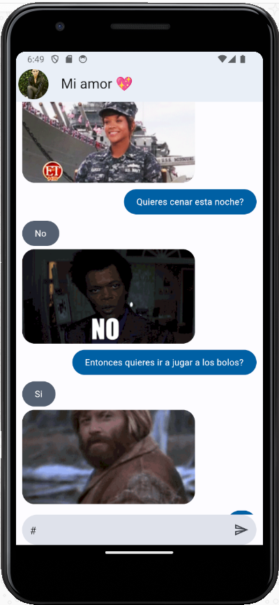
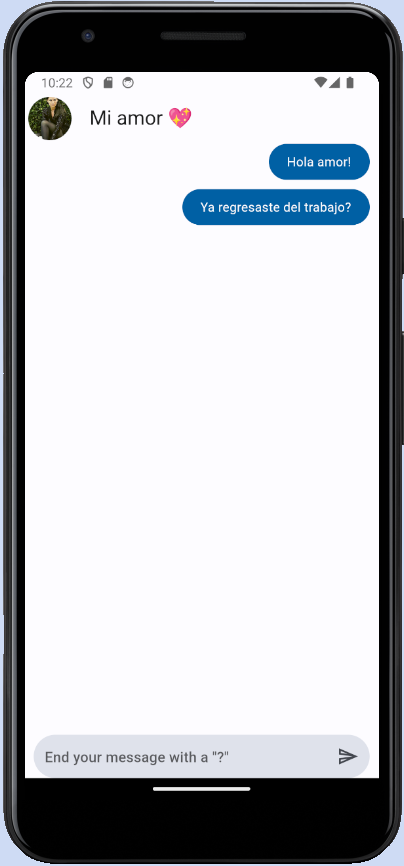

Chat_app es un proyecto diseñado con Flutter en el que se desarrolla un chat de respuesta afirmativa, negativa o de posibilidad, de forma aleatoria.

El desarrollo de esta app consta de dos partes, primeramente el diseño y después hemos pasado a implementar la funcionalidad.

## Diseño📝

Ademas de las siguientes implementaciones, destacar la configuración para que el cuadro del chat siempre muestre los últimos mensajes recibidos y enviados y se vayan ocultando los mas antiguos a medida que la pantalla muestra lo ultimo.

También destacar, la configuración para que al hacer click fuera del teclado, este se oculte.

También se ha trabajado con:

-TextEditingControllers

-Focus Nodes

-ThemeData

-Widgets como:

* Containers

* SizeBox

* ListViews

* CustomWidgets

* Expanded

* Padding

* Image (desde internet)

* ClipRRect (bordes redondeados)

Entre otros.

[teclado](https://github.com/jllanas1986/Flutter_Chat_app/assets/122029674/587b421d-916e-4c5f-b7cf-bc7cd9cfc16a)

## Funcionalidad 🔩

Para la funcionalidad se ha implementado una llamada a una API a través de DIO, la API esta configurada para devolver de forma aleatoria un mensaje de si, no o podría ser acompañado de un gif temático.

Se ha trabajado con:

* Gestores de estado

* Mappers

* Peticiones HTTP

* Dio

* Paquetes

* Funciones que retornan valores como callbacks

* Scroll

* Provider

Aprender esta funcionalidad genera una buena base de como alojar el estado fuera de los widgets y que los widgets se actualicen y tomen la información que necesitan del gestor de estado.

[response](https://github.com/jllanas1986/Flutter_Chat_app/assets/122029674/7fb2d6ca-9630-4422-9f45-21840370d3a3)

## Autor ✒️

- **Jose Llanas** - [jllanas1986](https://github.com/jllanas1986)
